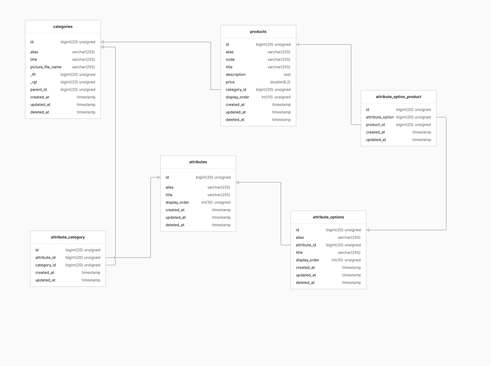

# Ecommerce-laravel

1. Представлено схему архітектури майбутнього проекту магазину, та зв'язки між сутностями.

2. В адмін панелі проекту ми створюємо першочергово категорії та підкатегорії, використовуємо parent_id чим і досягається динамічна вкладеність. І сама вкладена підкатегорія і є товаром. Далі ми створюємо attrebutes які і є характеристиками товару (розміри, кольори і тд.) і безпосередньо їх значення attrebute_options значення характеристик(червоний, жовтий і тд.). Потім ми створюємо самі продукти і зв'язуємо їх з
attrebute_options багато до багатьох і категорії з attrebutes багато до багатьох.
3. Для відображення на фронтенді проекту. За категориями ми тягнемо attrebutes з attrebute_options і products у яких вкладені attrebute_options і attrebutes відповідно. Там ми можемо їх відфільтрувати та відобразити з їх характеристиками.
4. Створив ресурси моделей сутностей для відображення залежностей, та вкладеності даних.
[Category resourse](CategoryResourse.php)
